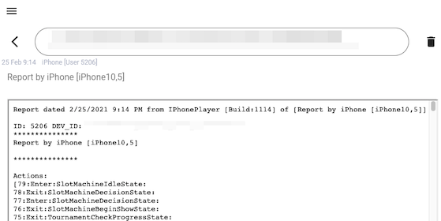

# LogKeep

This is a Flutter tool used for easy logs sharing within development and QA teams.
Supports iOS/Android/Web and  Dart backend API.

## Usage example

Typical usage:
* QA engineer or anyone in the team encounters error in the app
* Whether it is an error popup or just a suspicious behaviour there is a button to call LogKeeper (to upload logs there)
* This button reads log file and makes POST request. An example below is for C# Unity 

```csharp
var form = new WWWForm();

// Prepare log data
form.AddField("title", title);
form.AddField("author", author);
form.AddField("project", project);
form.AddField("contents", contents); // the log contents

// Send
var uwr = UnityWebRequest.Post("your_url" + "/save", form);
yield return uwr.SendWebRequest();
if (uwr.isNetworkError || uwr.isHttpError)
{
    // error
    return;
}

// Read result
var raw = Encoding.UTF8.GetString(uwr.downloadHandler.data);
var id = JSON.Parse(raw)["body"]["id"].Value;
var urlFormat = JSON.Parse(raw)["body"]["url_format"].Value;

// Get the link to the log
var link = string.Format(urlFormat, id);
_clipboardService.SetText(link);
ShowNotifications("Report link copied to clipboard");
```

* Now a person has the link to the uploaded log (this example copies it to clipboard as well)
* It can be shared to the Bug report or just be posted to the chat.
Link redirects to this log like this:


Now your teammates can see this log and it will be kept there like this:


Yes, there are tons of tools such as Log Stash, Kibana but this one
 - does only one simple common task
 - deployed within seconds and completely free
 - easy to be used by anyone in your team
 
## Description

It is also an example of using such patterns and tools as:
* [Flutter Bloc](https://pub.dev/packages/flutter_bloc)
* [Firebase Firestore](https://firebase.google.com/docs/firestore)
* simple Dart backend (with [shelf](https://pub.dev/packages/shelf) and Firebase)
* shared Dart code project usage with Docker
* [Firebase Flutter app hosting](https://firebase.google.com/docs/hosting)

Contains 3 projects:
- log_keep
- log_keep_back
- log_keep_shared

Backend part log_keep_back provides an API to upload logs and to retrieve links to share them.  
Client part log_keep is used to view and/or upload logs.

Storage uses Firestore (but anything else can be used too).

Folders structure is based on https://hub.docker.com/r/google/dart-runtime-base
in order to use shared code in log_keep_shared both on the client and server sides.

## How to setup

### Firebase Account

* Create one at https://firebase.google.com/
* Add apps that you need (iOS/Android/Web)
* Enable Firestore and create empty collections ("projects" and "logs")

### Setup it up in your project

in log_keep:
* add google-services.json for Android
* add GoogleService-Info.plist for iOS
* add firebaseConfig.js near index.html which should contain code like this:

```javascript
var firebaseConfig = {
    apiKey: "..",
    authDomain: "..",
    projectId: "..",
    storageBucket: ".",
    messagingSenderId: "..",
    appId: "..",
    measurementId: ".."
};

firebase.initializeApp(firebaseConfig);
```

### Google Service Account

For a backend to run you will need a Google Service Account https://cloud.google.com/iam/docs/service-accounts. 

Service account credentials could be passed to log_keep_back via .env file:
* private_key_id
* client_email
* client_id
* private_key
* databaseParentPath="projects/[PROJECT_ID]/databases/(default)/documents"
* serverLogUrlFormat="https://[PROJECT_ID].web.app/#/details?id={0}"	

Instructions on how to build & deploy server can also be found here https://hub.docker.com/r/google/dart-runtime-base

## To build and host Web client use
* cd log_keep
* flutter build web 
* init and login using Firebase CLI 
* firebase deploy --only hosting
